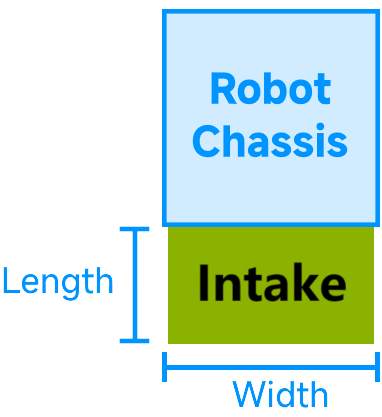

# Simulating Intake
!!! info
      You are reading the documentation for a Beta version of maple-sim. API references are subject to change in future versions.

---
## 0. Overview
Intakes, or mechanisms that extend from the robot to collect game pieces from the field, are simulated by the `IntakeSimulation` class.

The intake is modeled as a 2D shape attached to one side of the robot's chassis. Intakes are represented as rectangles with a fixed width.

<div style="display: flex;" markdown>
{width="49%"}
{ width= "49%"}
</div>

When deactivated, the rectangle is removed from the collision space, representing the intake retracting back into the robot’s frame.

When activated, the rectangle is added to the robot's collision space in the physics engine, simulating an intake that extends outward for a certain length.

This class simulates an idealized "touch it, get it" intake, meaning that when the intake is turned on, game pieces of the specified type are immediately collected upon contact — regardless of whether they are pushed towards the intake.

!!! tip
      This simulation is intended for testing code and does not exactly replicate how your real intake mechanism works.


---
## 1. Creating Intake Simulation
You need to create an instance of `IntakeSimulation` in your `IntakeIOSim`.

```java
// subsystems/intake/IntakeIOSim.java
public class IntakeIOSim {
    private final IntakeSimulation intakeSimulation;
    public IntakeIOSim(AbstractDriveTrainSimulation driveTrain) {
        // Here, create the intake simulation with respect to the intake on your real robot
        this.intakeSimulation = new IntakeSimulation(...);
    }
}
```

=== "In-The-Frame (ITF) Intakes"
    <div style="display: flex; align-items:center">
        <div style="align-items: center; width: 29%">
            
        </div>
        <div style="width: 70%; font-size:13px;">
            ```Java
            this.intakeSimulation = IntakeSimulation.InTheFrameIntake(
                    // Specify the type of game pieces that the intake can collect
                    "Note",
                    // Specify the drivetrain to which this intake is attached
                    driveTrainSimulation,
                    // Specify width of the intake
                    Meters.of(0.7),
                    // The intake is mounted on the back side of the chassis
                    IntakeSimulation.IntakeSide.BACK,
                    // The intake can hold up to 1 note
                    1);
            ```
        </div>
    </div>
=== "Over-The-Bumper (OTB) Intakes"
    <div style="display: flex; align-items:center">
        <div style="align-items: center; width: 29%"> 
            
        </div>
        <div style="width: 70%; font-size:13px;">
            ```Java
            this.intakeSimulation = IntakeSimulation.OverTheBumperIntake(
                    // Specify the type of game pieces that the intake can collect
                    "Note",
                    // Specify the drivetrain to which this intake is attached
                    driveTrainSimulation,
                    // Width of the intake
                    Meters.of(0.7),
                    // The extension length of the intake beyond the robot's frame (when activated)
                    Meters.of(0.2),
                    // The intake is mounted on the back side of the chassis
                    IntakeSimulation.IntakeSide.BACK,
                    // The intake can hold up to 1 note
                    1);
            ```
        </div>
    </div>
=== "Custom Shape Intakes"
    <div style="font-size:13px;">
        ```Java
        this.intakeSimulation = new IntakeSimulation(
                // Specify the type of game pieces that the intake can collect
                "Note",
                // Specify the drivetrain to which this intake is attached
                driveTrainSimulation, 
                // Our intake has a custom shape of a triangle (shape is specified in chassis frame-of-reference)
                new Triangle(new Vector2(0, 0), new Vector2(0.2, 0), new Vector2(0, 0.2)),
                // The intake can hold up to 1 note
                1);
        ```
    </div>

!!! tip
      Use setCustomIntakeCondition(Predicate&lt;GamePieceOnFieldSimulation&gt;) to define a custom condition which controls which game pieces can enter the intake. Example usage: if you want your simulated intake to only intake game pieces that are in a specific orentation.

---
## 2. Using intake simulation
Next, implement the methods defined by the `IntakeIO` interface.

Intakes can be turned on and off by calling `startIntake()` and `stopIntake()`.
Most intakes detect game pieces inside the mechanism (usually with a beam breaker sensor). You can simulate this by checking `gamePiecesInIntakeCount`.

```java
public class IntakeIOSim implements IntakeIO {
    ...

    @Override // Defined by IntakeIO
    public void setRunning(boolean runIntake) {
        if (runIntake)
            intakeSimulation.startIntake(); // Extends the intake out from the chassis frame and starts detecting contacts with game pieces
        else
            intakeSimulation.stopIntake(); // Retracts the intake into the chassis frame, disabling game piece collection
    }

    @Override // Defined by IntakeIO
    public boolean isNoteInsideIntake() {
        return intakeSimulation.getGamePiecesAmount() != 0; // True if there is a game piece in the intake
    }

    @Override // Defined by IntakeIO
    public void launchNote() {
        // if there is a note in the intake, it will be removed and return true; otherwise, returns false
        if (intakeSimulation.obtainGamePieceFromIntake())
            ShooterIOSim.launchNote(); // notify the simulated flywheels to launch a note
    }
}

```

!!! tip
      As shown in the code above, you can notify `FlyWheelIOSim` (the simulated flywheel mechansim) to shoot the note out when the note is passed to the shooter from the intake. See [Simulating GamePiece Projectiles](./simulating-projectiles.md) for more details.

   
      If you want to simulate how the note moves inside the intake/feeder, you can take the indefinite integral of the intake/feeder voltage over time since the note entered the intake.  This gives an approximation of the note's position in the feeder.

      An example of simulating an intake together with flywheels can be found [here](https://github.com/Shenzhen-Robotics-Alliance/maple-sim/blob/main/templates/AdvantageKit_AdvancedSwerveDriveProject/src/main/java/frc/robot/subsystems/intake/IntakeIOSim.java).

